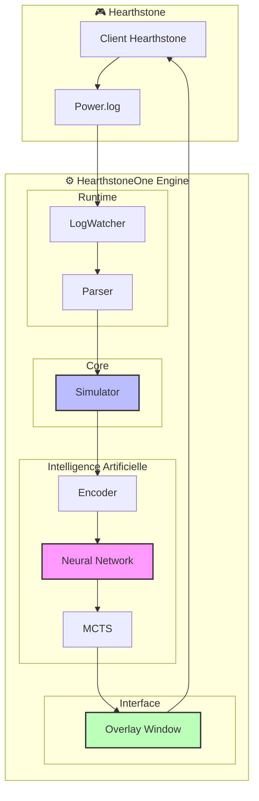
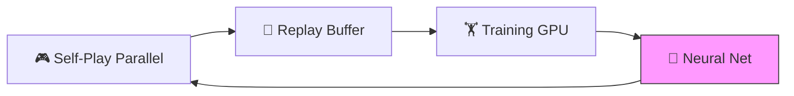

# 🃏 HearthstoneOne

> **Assistant IA pour Hearthstone** — Coaching en temps réel + Entraînement AlphaZero


---

## ✨ Qu'est-ce que HearthstoneOne ?

HearthstoneOne est un écosystème complet d'Intelligence Artificielle pour Hearthstone :

- 🧠 **IA AlphaZero** — Apprend à jouer de zéro via self-play (MCTS + Deep Learning)
- 👁️ **Overlay Temps Réel** — Design **Glassmorphism Premium** avec suggestions de coups
- 🏎️ **Parallélisation** — Entraînement ultra-rapide via **Multiprocessing** (8+ workers)
- 🎮 **Simulateur Universel** — Supporte 1800+ cartes et l'intégration de **Meta Decks** réels
- 📈 **Monitoring TensorBoard** — Suivi en direct des metrics et de la probabilité de victoire
- 🕵️ **Auto-Validation** — Outil de test automatique pour l'intégrité des effets de cartes

---

## 🏗️ Architecture



---

## 🧠 AlphaZero : Le Cerveau

L'IA utilise l'algorithme **AlphaZero** de DeepMind, adapté à Hearthstone.

### Cycle d'Apprentissage



| Composant | Description |
|-----------|-------------|
| **Self-Play** | 8 processus en parallèle (ProcessPoolExecutor) pour générer des données |
| **Replay Buffer** | Stocke les trajectoires (état, action, résultat) |
| **Training** | Entraîne le réseau Actor-Critic sur RTX 3070 Ti |
| **Neural Net** | Prédit la politique et la valeur (Win Probability %) |

---

## 👁️ Live Assistant

L'overlay affiche les suggestions en temps réel par-dessus Hearthstone avec un look moderne.

### Fonctionnalités

| Suggestion | Visuel | Status |
|------------|--------|--------|
| Jouer une carte (avec cible) | 🟢 Flèche Néon | ✅ |
| Jouer une carte (sans cible) | 🟡 Cercle Pulsating | ✅ |
| Attaquer (créature → cible) | 🔵 Flèche Bleue | ✅ |
| Probabilité de victoire | 📊 Barre de progression | ✅ |
| Pouvoir Héroïque | ⏳ Icône dédiée | 🚧 |

---

## 🚀 Installation

### Prérequis

- Python 3.10+
- Hearthstone installé (en anglais de préférence)
- CUDA (recommandé pour NVIDIA RTX)

### Étapes

```bash
# 1. Cloner
git clone https://github.com/Kevzi/-HearthstoneOne.git
cd HearthstoneOne

# 2. Installer les dépendances
pip install -r requirements.txt

# 3. Configurer les logs Hearthstone
# Créez le fichier log.config dans %LocalAppData%\Blizzard\Hearthstone\
```

---

## 📖 Utilisation

### Lancer l'Assistant Live
```bash
python runtime/live_assistant.py
```

### Entraîner l'IA
```bash
python training/trainer.py
```

### Vérifier les effets de cartes
```bash
python tools/verify_effects.py
```

---

## 🔗 Liens
- [CHANGELOG.md](docs/CHANGELOG.md) — Historique des versions
- [TASKS.md](docs/TASKS.md) — Feuille de route détaillée

---

<p align="center">
  <b>HearthstoneOne</b> — Projet open-source pour la recherche et l'éducation.
</p>
