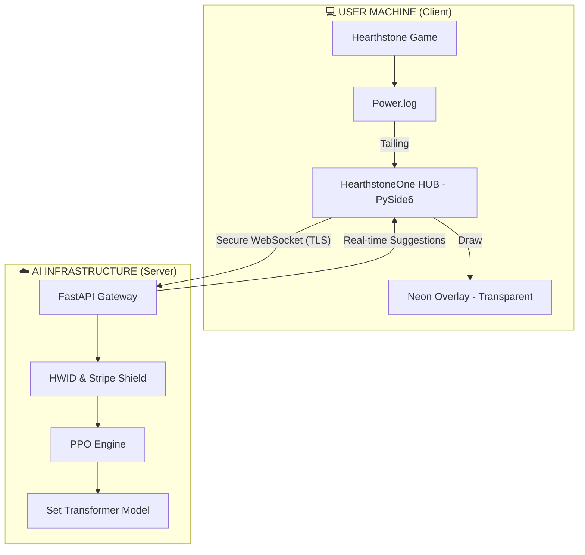

<p align="center">
  
</p>

# 💠 HearthstoneOne
> **The Ultimate SaaS AI Coaching Platform for Hearthstone** — Real-time Intelligence via Cloud-Inference


---

## ✨ What is HearthstoneOne?

HearthstoneOne is a professional-grade AI ecosystem designed for both players and researchers. Unlike traditional local trackers, it uses a **Thick Server / Thin Client** architecture to provide state-of-the-art decision making while protecting intellectual property.

- 🧠 **PPO + Set Transformer** — Uses Proximal Policy Optimization and permutation-invariant attention networks to capture complex card synergies.
- ☁️ **Cloud Inference** — The AI "Brain" lives on high-performance servers, ensuring low latency and high security.
- 👁️ **Premium Animated Overlay** — Neon-style, pulsating visual guides drawn directly over the game using a high-performance Win32 transparent layer.
- 🛡️ **HWID Security** — Enterprise-grade hardware locking and token-based authentication (Ready for Stripe).
- 🏎️ **Universal Simulator** — Custom high-performance engine supporting 7000+ cards with lazy-evaluation optimizations.

---

## 🏗️ SaaS Architecture

HearthstoneOne is split into two optimized components:



---

## 🚀 Getting Started

### 1. Server Setup (Backend)
Requires a CUDA-capable GPU for production-ready inference.
```bash
# Install dependencies
pip install -r requirements.txt

# Start the AI Gateway
python -m uvicorn server.main:app --host 0.0.0.0 --port 8000
```

### 2. Client Setup (Frontend / HUB)
```bash
# Run the Client HUB
python client/main.py
```

### 3. Training the AI
```bash
# Start the League Training pipeline
python training/ppo_trainer.py
```

---

## 🛡️ Security & Distribution

HearthstoneOne is designed with commercial distribution in mind:
- **HWID Locking**: Prevents account sharing by binding the license to a single motherboard UUID.
- **Binaire Compilation**: The client can be compiled using **Nuitka** to protect source code.
```bash
python tools/build_client.py
```

---

## 🔧 Technical Stack
- **AI**: PyTorch, PPO, Multi-Head Attention (Set Transformer).
- **Backend**: FastAPI, Websockets, Python 3.13.
- **Frontend**: PySide6 (Qt), Win32 API (ctypes), watchdog.
- **Optimization**: Lazy Stat Evaluation, O(1) Snapshotting, GPU Inference.

---

<p align="center">
  <b>HearthstoneOne</b> — Advanced AI Coaching for Strategy Games.
</p>
