```mermaid
flowchart LR
    A[🎮 Self-Play Parallel] --> B[💾 Replay Buffer]
    B --> C[🏋️ Training GPU]
    C --> D[🧠 Neural Net]
    D --> A

    style D fill:#f9f,stroke:#333
```

# 🃏 HearthstoneOne

> **AI Assistant for Hearthstone** — Real-time Coaching + AlphaZero Training


---

## ✨ What is HearthstoneOne?

HearthstoneOne is a complete Artificial Intelligence ecosystem for Hearthstone:

- 🧠 **AlphaZero AI** — Learns to play from scratch via self-play (MCTS + Deep Learning)
- 🖥️ **Premium Dashboard** — Full GUI to control training, visualize metrics, and manage meta decks
- 👁️ **Real-Time Overlay** — **Glassmorphism Design** overlay providing live move suggestions
- 🏎️ **Parallelization** — Ultra-fast training via **Multiprocessing** (8+ workers)
- 🎮 **Universal Simulator** — Supports 1800+ cards and integration of real **Meta Decks**
- 📈 **TensorBoard Monitoring** — Live tracking of metrics and win probability
- 🕵️ **Auto-Validation** — Automated testing tool for card effect integrity

---

## 🏗️ Architecture

```mermaid
flowchart TB
    subgraph GAME["🎮 Hearthstone"]
        Client[Hearthstone Client]
        Log[Power.log]
        Client --> Log
    end

    subgraph ENGINE["⚙️ HearthstoneOne Engine"]
        subgraph RUNTIME["Runtime"]
            Watcher[LogWatcher]
            Parser[Parser]
            Watcher --> Parser
        end

        subgraph CORE["Core"]
            Sim[Simulator]
            Parser --> Sim
        end

        subgraph AI["Artificial Intelligence"]
            Encoder[Encoder]
            Model[Neural Network]
            MCTS[MCTS]
            Sim --> Encoder
            Encoder --> Model
            Model --> MCTS
        end

        subgraph UI["Interface"]
            Dashboard[Dashboard GUI]
            Overlay[Overlay Window]
            MCTS --> Overlay
        end
    end

    Log --> Watcher
    Overlay --> Client

    style Model fill:#f9f,stroke:#333,stroke-width:2px
    style Sim fill:#bbf,stroke:#333,stroke-width:2px
    style Overlay fill:#bfb,stroke:#333,stroke-width:2px
    style Dashboard fill:#bfb,stroke:#333,stroke-width:2px
```



---

## 🧠 AlphaZero: The Brain

The AI uses DeepMind's **AlphaZero** algorithm, adapted for Hearthstone.

### Learning Cycle



| Component | Description |
|-----------|-------------|
| **Self-Play** | 8 parallel processes (ProcessPoolExecutor) to generate data |
| **Replay Buffer** | Stores trajectories (state, action, result) |
| **Training** | Trains Actor-Critic network on RTX 3070 Ti |
| **Neural Net** | Predicts policy and value (Win Probability %) |

---

## 🖥️ Dashboard & Overlay

### AI Dashboard
A centralized control center built with **PyQt6**:
- **Training Tab**: Start/Stop the engine, visualize Loss & Winrate evolution in real-time.
- **Spy Mode**: Configure the overlay, choose the Inference Model.
- **Meta Decks**: Browse the library of top-tier decks used for training with full card lists.

### Live Assistant
The overlay displays suggestions in real-time on top of Hearthstone with a modern look.

| Suggestion | Visual | Status |
|------------|--------|--------|
| Play Card (targeted) | 🟢 Neon Arrow | ✅ |
| Play Card (untargeted) | 🟡 Pulsating Circle | ✅ |
| Attack (minion → target) | 🔵 Blue Arrow | ✅ |
| Win Probability | 📊 Progress Bar | ✅ |
| Hero Power | ⏳ Dedicated Icon | 🚧 |

---

## 🚀 Installation

### Prerequisites

- Python 3.10+
- Hearthstone installed (English preferred)
- CUDA (recommended for NVIDIA RTX)

### Steps

```bash
# 1. Clone
git clone https://github.com/Kevzi/-HearthstoneOne.git
cd HearthstoneOne

# 2. Install dependencies
pip install -r requirements.txt

# 3. Configure Hearthstone Logs
# Create/Edit log.config in %LocalAppData%\Blizzard\Hearthstone\
```

---

## 📖 Usage

### Launch the Dashboard (Recommended)
```bash
python gui/main_window.py
```

### Launch Live Assistant Only
```bash
python runtime/live_assistant.py
```

### Train AI (CLI Mode)
```bash
python training/trainer.py
```

### Verify Card Effects
```bash
python tools/verify_effects.py
```

---

## 🔗 Links
- [CHANGELOG.md](docs/CHANGELOG.md) — Version History
- [TASKS.md](docs/TASKS.md) — Detailed Roadmap

---

<p align="center">
  <b>HearthstoneOne</b> — Open-source project for AI research and education.
</p>
